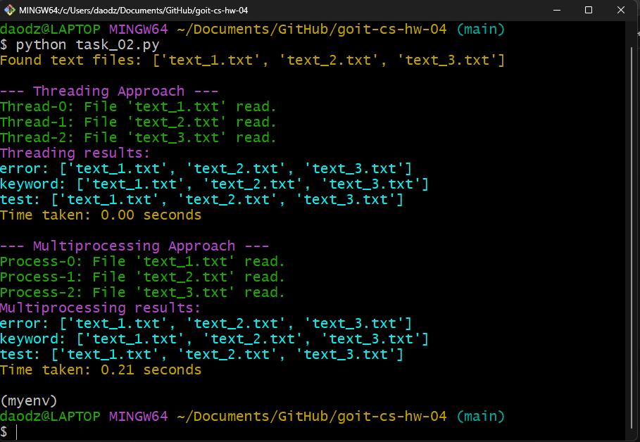

# Homework for the Module “Concurrency and Parallelism”

Today, as part of your homework, you will apply concepts of multiprocessing and multithreading to develop an efficient program for parallel keyword search in text files.

## Technical Task Description

Develop a program that processes and analyzes text files in parallel to search for specified keywords. Create two versions of the program: one using the threading module for multithreaded programming, and another using the multiprocessing module for multiprocessing.

### Step-by-Step Instructions

**1. Implement a Multithreaded Approach (using `threading`):**

- Divide the list of files among multiple threads.
- Each thread should search for the specified keywords in its assigned set of files.
- Collect and display the search results from all threads.

**The Result of the Code**

{width=600}

**2. Implement a Multiprocessing Approach (using `multiprocessing`):**

- Divide the list of files among multiple processes.
- Each process should handle its subset of files and search for the keywords.
- Use a data exchange mechanism (e.g., Queue) to collect and display the search results.

**The Result of the Code**

{width=600}

### Acceptance Criteria

- Both the multithreaded and multiprocessing approaches to file processing are implemented.
- The files are properly distributed among threads/processes.
- The code measures and outputs execution time for each version.
- Error handling and exception management are implemented, particularly for file system operations.
- Both versions of the program return a dictionary where:
  - The key is a search keyword.
  - The value is a list of file paths where the keyword was found.
